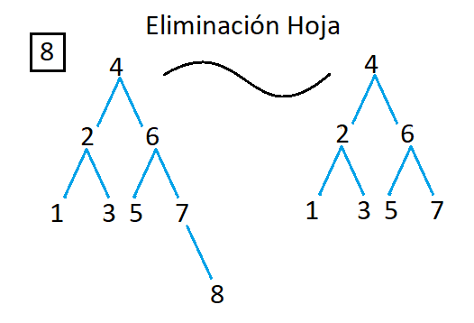
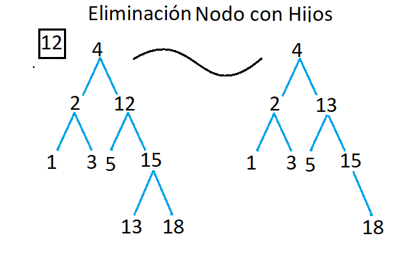
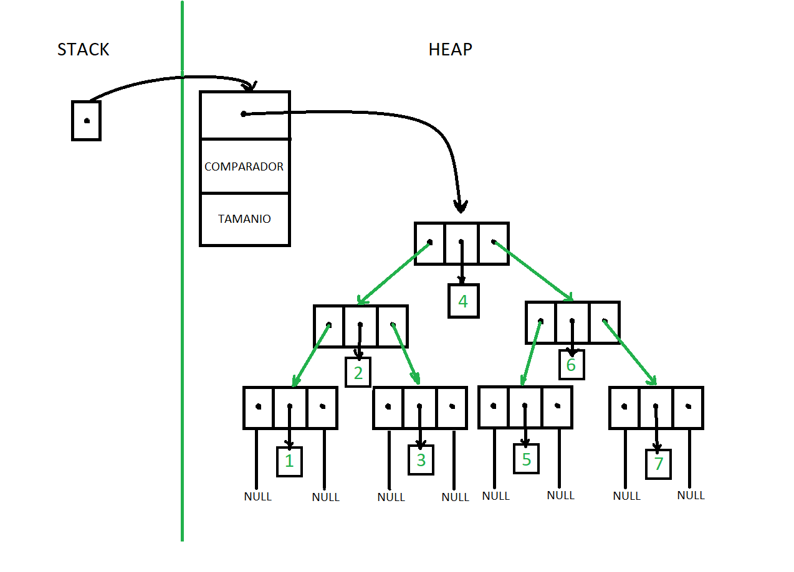

# TDA ABB

## Repositorio de (Nombre Apellido) - (Padrón) - (Mail)

- Para compilar:

```bash
línea de compilación
```

- Para ejecutar:

```bash
línea de ejecución
```

- Para ejecutar con valgrind:
```bash
línea con valgrind
```
---
##  Funcionamiento

Explicación de cómo funcionan las estructuras desarrolladas en el TP y el funcionamiento general del mismo.

Aclarar en esta parte todas las decisiones que se tomaron al realizar el TP, cosas que no se aclaren en el enunciado, fragmentos de código que necesiten explicación extra, etc.

Incluír **EN TODOS LOS TPS** los diagramas relevantes al problema (mayormente diagramas de memoria para explicar las estructuras, pero se pueden utilizar otros diagramas si es necesario).

### Por ejemplo:

El programa funciona abriendo el archivo pasado como parámetro y leyendolo línea por línea. Por cada línea crea un registro e intenta agregarlo al vector. La función de lectura intenta leer todo el archivo o hasta encontrar el primer error. Devuelve un vector con todos los registros creados.

<div align="center">

</div>

En el archivo `sarasa.c` la función `funcion1` utiliza `realloc` para agrandar la zona de memoria utilizada para conquistar el mundo. El resultado de `realloc` lo guardo en una variable auxiliar para no perder el puntero original en caso de error:

```c
int *vector = realloc(vector_original, (n+1)*sizeof(int));

if(vector == NULL)
    return -1;
vector_original = vector;
```


<div align="center">

</div>

---

## Respuestas a las preguntas teóricas

### Árbol Binario (AB):

**Un Árbol Binario** es una estructura de datos jerárquica en forma de árbol en la que cada nodo tiene como máximo dos hijos, denominados hijo izquierdo y hijo derecho. Cada nodo puede contener un elemento de datos y apuntadores a sus hijos. Si un hijo está ausente, el apuntador correspondiente puede ser nulo. Los árboles binarios se utilizan comúnmente en informática para organizar y gestionar datos de manera eficiente, ya que permiten una rápida búsqueda, inserción y eliminación de elementos.

### Árbol Binario de Búsqueda (ABB):

**Un Árbol Binario de Búsqueda (ABB)** es una variante del Árbol Binario en la que se impone una restricción adicional: para cada nodo, todos los elementos en el subárbol izquierdo son menores que el elemento del nodo, y todos los elementos en el subárbol derecho son mayores que el elemento del nodo. Esta propiedad hace que la búsqueda, inserción y eliminación en un ABB sean altamente eficientes, ya que permite realizar operaciones en tiempo logarítmico en promedio. Los ABB se utilizan ampliamente en aplicaciones donde se necesita un acceso rápido a los datos, como en la implementación de diccionarios, bases de datos y algoritmos de búsqueda y ordenamiento.

### Inserción:

<div align="center">

</div>

**Comparación con el nodo raíz (4):**
- Empezamos comparando el elemento que queremos insertar (8) con el nodo raíz (4).
- Como 8 es mayor que 4, nos movemos al hijo derecho del nodo raíz.

**Movimiento al subárbol derecho:**
- Ahora estamos en el nodo con valor 6.

**Comparación con el nodo actual (6):**
- Comparamos 8 con el valor del nodo actual (6).
- Como 8 es mayor que 6, nos movemos al hijo derecho del nodo actual.

**Movimiento al subárbol derecho:**
- Ahora estamos en el nodo con valor 7.

**Comparación con el nodo actual (7):**
- Comparamos 8 con el valor del nodo actual (7).
- Como 8 es mayor que 7 y el nodo actual no tiene un hijo derecho, sabemos que debemos insertar el elemento 8 como el hijo derecho de este nodo.

**Inserción del nuevo nodo (8):**
- Insertamos el elemento 8 como hijo derecho del nodo 7.
  
Así es como se realiza la inserción del elemento 8 en el ABB. La inserción en un ABB implica encontrar el lugar adecuado para el nuevo elemento siguiendo las comparaciones basadas en el valor de los nodos, y luego insertarlo como un nuevo nodo en la posición correcta del árbol para mantener la propiedad de orden de un ABB.

En un ABB bien balanceado, la altura del árbol tiende a ser logarítmica en función del número de nodos, lo que resulta en una complejidad de inserción de O(log n), donde n es el número de nodos en el árbol. Esto significa que, en promedio, la inserción tomará un tiempo proporcional al logaritmo del número de elementos en el árbol.

Sin embargo, si el árbol está desbalanceado, la inserción podría requerir recorrer una cantidad lineal de nodos en el peor de los casos, lo que llevaría a una complejidad de O(n), donde n es el número de nodos en el árbol. Esto podría ocurrir, por ejemplo, si los elementos se insertan en orden ascendente o descendente, lo que daría como resultado un árbol degenerado en una lista enlazada.

En resumen, la complejidad de la inserción en un ABB puede variar dependiendo de la estructura del árbol, pero en promedio es eficiente, con una complejidad de O(log n) en un árbol bien balanceado.

### Busqueda:

<div align="center">

</div>

**Ahora, vamos a realizar una búsqueda en este árbol para encontrar el número 13:**

**Comparación con el nodo raíz (4):**
- Empezamos comparando el número buscado (13) con el nodo raíz (4).
- Como 13 es mayor que 4, nos movemos al hijo derecho del nodo raíz.

**Movimiento al subárbol derecho:**
- Ahora estamos en el nodo con el número 12.

**Comparación con el nodo actual (12):**
- Comparamos el número buscado (13) con el número en el nodo actual (12).
- Como 13 es mayor que 12, nos movemos al hijo derecho del nodo actual.

**Movimiento al subárbol derecho:**
- Ahora estamos en el nodo con el número 15.

**Comparación con el nodo actual (15):**
- Comparamos el número buscado (13) con el número en el nodo actual (15).
- Como 13 es menor que 15, nos movemos al hijo izquierdo del nodo actual.

**Movimiento al subárbol izquierdo:**
- Ahora estamos en el nodo con el número 13.

**Comparación con el nodo actual (13):**
- Hemos encontrado el número que estábamos buscando.

Entonces, la búsqueda en este árbol binario de búsqueda para el número 13 implicó seguir un camino descendente desde el nodo raíz, tomando decisiones basadas en comparaciones de valores, hasta encontrar el nodo que contenía el valor buscado.

La complejidad de la búsqueda en un ABB es O(n), donde n es la altura del árbol. En este caso, la altura del árbol es relativamente baja porque es un árbol balanceado, por lo que la búsqueda es bastante eficiente.

### Eliminación:
#### Eliminación hoja 
<div align="center">

</div>

**Comenzamos desde la raíz**:  

**Búsqueda del nodo 8**:  
   - Buscamos el nodo con el valor 8 en el árbol.

**Identificación del nodo 8 como hoja**:  
   - El nodo 8 es una hoja, es decir, no tiene hijos.

**Eliminación del nodo 8**:  
   - Eliminamos el nodo 8 del árbol.

Así es como se realiza la eliminación de la hoja 8 en el árbol. La eliminación de una hoja en un árbol binario implica simplemente eliminar el nodo hoja del árbol, ajustando los enlaces adecuadamente para mantener la estructura del árbol.

Eliminar una hoja en un árbol binario de búsqueda es relativamente sencillo, ya que solo implica ajustar los enlaces del nodo padre para eliminar el nodo hoja. La complejidad es O(h).

#### Eliminación nodo con hijos 
<div align="center">

</div>

**Comenzamos desde la raíz**:  

**Búsqueda del nodo con valor 12**:  
   - Buscamos el nodo con el valor 12 en el árbol.

**Identificación del nodo 12 con hijos**:  
   - El nodo 12 tiene dos hijos.

**Búsqueda del sucesor inmediato**:  
   - Para eliminar un nodo con dos hijos, necesitamos encontrar su sucesor inmediato. El sucesor inmediato es el nodo más pequeño en el subárbol derecho del nodo que estamos eliminando.

**Sucesor inmediato del nodo 12**:  
   - El sucesor inmediato del nodo 12 es el nodo con valor 13.

**Reemplazo del nodo 12 con su sucesor inmediato 13**:  
   - Reemplazamos el valor del nodo 12 con el valor del sucesor inmediato, es decir, 13.

**Eliminación del nodo 13 del subárbol derecho**:  
   - Ahora, eliminamos el nodo 13, que se convierte en la nueva hoja o nodo con un solo hijo.

Así es como se realiza la eliminación del nodo con hijos 12 en el árbol. La eliminación de un nodo con dos hijos en un árbol binario implica encontrar su sucesor inmediato y reemplazar el nodo a eliminar con este sucesor. Luego, se elimina el sucesor inmediato del subárbol derecho, manteniendo así la estructura y la propiedad de orden del árbol.

Eliminar un nodo con dos hijos es un poco más complejo. Implica encontrar y reemplazar el valor del nodo con su sucesor inmediato (el menor valor en el subárbol derecho), y luego eliminar este sucesor. La complejidad también es O(h).

### Grafico de memoria
<div align="center">

</div>

