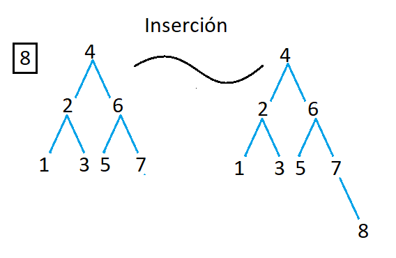
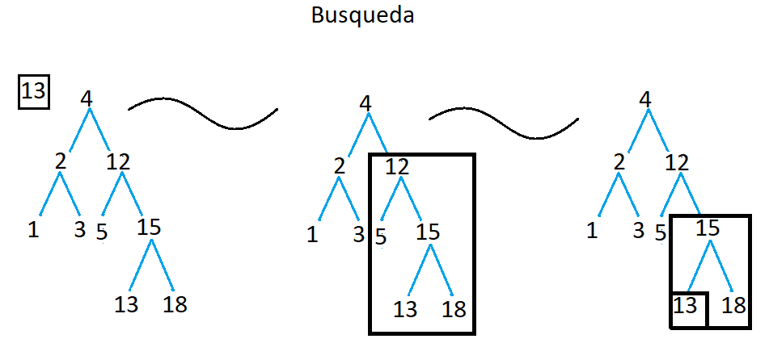

# TDA ABB

## Repositorio de (Nombre Apellido) - (Padrón) - (Mail)

- Para compilar:

```bash
línea de compilación
```

- Para ejecutar:

```bash
línea de ejecución
```

- Para ejecutar con valgrind:
```bash
línea con valgrind
```
---
##  Funcionamiento

Explicación de cómo funcionan las estructuras desarrolladas en el TP y el funcionamiento general del mismo.

Aclarar en esta parte todas las decisiones que se tomaron al realizar el TP, cosas que no se aclaren en el enunciado, fragmentos de código que necesiten explicación extra, etc.

Incluír **EN TODOS LOS TPS** los diagramas relevantes al problema (mayormente diagramas de memoria para explicar las estructuras, pero se pueden utilizar otros diagramas si es necesario).

### Por ejemplo:

El programa funciona abriendo el archivo pasado como parámetro y leyendolo línea por línea. Por cada línea crea un registro e intenta agregarlo al vector. La función de lectura intenta leer todo el archivo o hasta encontrar el primer error. Devuelve un vector con todos los registros creados.

<div align="center">

</div>

En el archivo `sarasa.c` la función `funcion1` utiliza `realloc` para agrandar la zona de memoria utilizada para conquistar el mundo. El resultado de `realloc` lo guardo en una variable auxiliar para no perder el puntero original en caso de error:

```c
int *vector = realloc(vector_original, (n+1)*sizeof(int));

if(vector == NULL)
    return -1;
vector_original = vector;
```


<div align="center">

</div>

---

## Respuestas a las preguntas teóricas


### Inserción

<div align="center">

</div>

**Comparación con el nodo raíz (4):**
- Empezamos comparando el elemento que queremos insertar (8) con el nodo raíz (4).
- Como 8 es mayor que 4, nos movemos al hijo derecho del nodo raíz.

**Movimiento al subárbol derecho:**
- Ahora estamos en el nodo con valor 6.

**Comparación con el nodo actual (6):**
- Comparamos 8 con el valor del nodo actual (6).
- Como 8 es mayor que 6, nos movemos al hijo derecho del nodo actual.

**Movimiento al subárbol derecho:**
- Ahora estamos en el nodo con valor 7.

**Comparación con el nodo actual (7):**
- Comparamos 8 con el valor del nodo actual (7).
- Como 8 es mayor que 7 y el nodo actual no tiene un hijo derecho, sabemos que debemos insertar el elemento 8 como el hijo derecho de este nodo.

**Inserción del nuevo nodo (8):**
- Insertamos el elemento 8 como hijo derecho del nodo 7.
  
Así es como se realiza la inserción del elemento 8 en el ABB. La inserción en un ABB implica encontrar el lugar adecuado para el nuevo elemento siguiendo las comparaciones basadas en el valor de los nodos, y luego insertarlo como un nuevo nodo en la posición correcta del árbol para mantener la propiedad de orden de un ABB.

### Busqueda

<div align="center">

</div>

Ahora, vamos a realizar una búsqueda en este árbol para encontrar el número 13.

1. Comenzamos en el nodo raíz, que contiene el número 4.
2. Comparamos el número que estamos buscando (13) con el número en el nodo actual (4).
   - Como 13 es mayor que 4, nos movemos al hijo derecho del nodo actual.
3. Ahora estamos en el nodo con el número 12.
4. Comparamos el número que estamos buscando (13) con el número en el nodo actual (12).
   - Como 13 es mayor que 12, nos movemos al hijo derecho del nodo actual.
5. Ahora estamos en el nodo con el número 15.
6. Comparamos el número que estamos buscando (13) con el número en el nodo actual (15).
   - Como 13 es menor que 15, nos movemos al hijo izquierdo del nodo actual.
7. Ahora estamos en el nodo con el número 13.
8. Comparamos el número que estamos buscando (13) con el número en el nodo actual (13).
   - Hemos encontrado el número que estábamos buscando.

Entonces, la búsqueda en este árbol binario de búsqueda para el número 13 implicó seguir un camino descendente desde el nodo raíz, tomando decisiones basadas en comparaciones de valores, hasta encontrar el nodo que contenía el valor buscado.

La complejidad de la búsqueda en un ABB es O(n), donde n es la altura del árbol. En este caso, la altura del árbol es relativamente baja porque es un árbol balanceado, por lo que la búsqueda es bastante eficiente.
